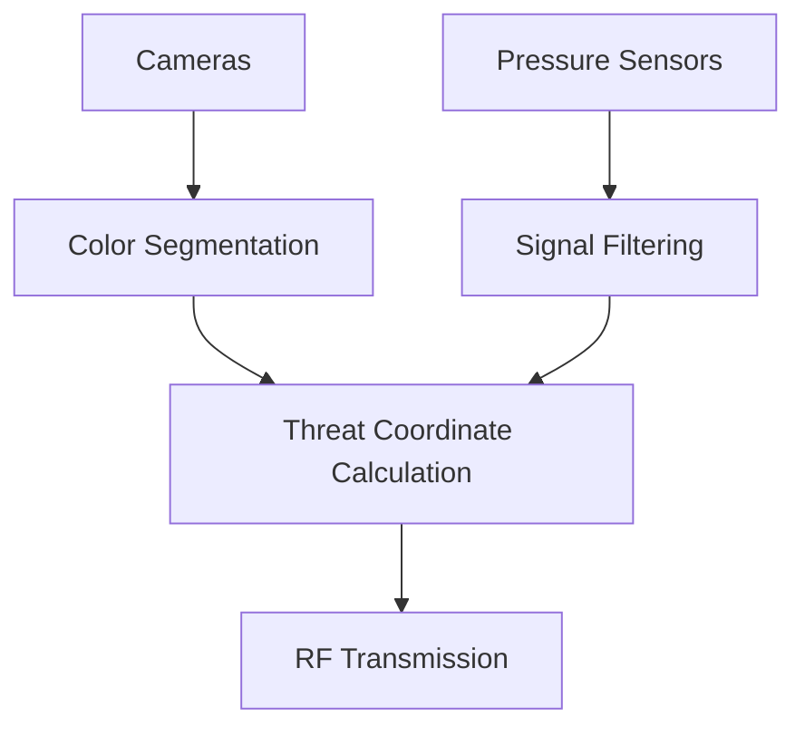
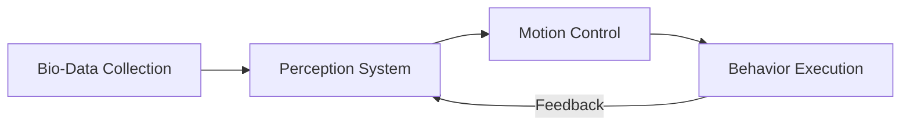

# Robotic Fish Autonomous System

[Robotic Fish System](https://github.com/CASIA-RoboticFish/StressBehavior-RoboFish/blob/main/roboticfish.PNG?raw=true)


## 🌊 System Overview

This repository contains the complete codebase for our bio-inspired robotic fish system, comprising three integrated components:

1. **Perception & Sensor Processing** (/Firmware_Sensor_Processing)  
   - Real-time stereo vision and lateral line processing
   - Threat detection and localization
   - Embedded firmware for Jetson Xavier

2. **Motion Control System** (/DecisionAndMotionControl)  
   - Receives processed perception data from Jetson Xavier
   - Executes bio-inspired motion planning algorithms
   - Generates real-time motor commands
   - Manages emergency avoidance behaviors


## Perception & Sensor Processing (/Firmware_Sensor_Processing)

### 🛠 Hardware Requirements

| Component              | Specification                          |
|------------------------|----------------------------------------|
| Onboard Computer       | Jetson Xavier NX                       |
| Cameras                | 2x Fisheye USB cameras  |
| Wireless Modules       | 2x RF modules   |
| Sensors                | 12-channel pressure sensor array       |


### 📌 Core Functionality
Processes multi-modal sensor inputs to detect and localize environmental stimuli:

| Sensor Type       | Processing Features                  | Output Format           |
|-------------------|--------------------------------------|-------------------------|
| Stereo Vision     | Red object detection, coordinate mapping | [x_pos, y_pos, area] |
| Lateral Line      | 12-channel pressure analysis         | [sensor_id, amplitude] |

### 📂 Code Structure
```
Firmware_Sensor_Processing/
├── multi_thread.py        - Main processing threads
├── rflink.py             - Custom communication protocol
├── Queue_def.py          - Data buffer implementation
└── serctl.py             - Hardware interface
```

### 🚀 Key Features

1. **Dual-Thread Architecture**  
   - `CameraThread`: Processes stereo vision (red object detection + coordinate mapping)
   - `SerialThread`: Handles lateral line sensor data (noise filtering + peak detection)

2. **Real-Time Processing**  
   - 50Hz pressure data sampling
   - 20FPS stereo vision processing
   - Adaptive signal filtering (Butterworth HPF + median smoothing)

3. **Threat Detection**  
   ```python
   # Example output format
   threat_data = {
       'vision': [x_coord, y_coord, area_size],
       'pressure': [sensor_id, response_value]
   }
   ```

### 🖥 Usage

1. Connect hardware:
   ```python
   # In main():
   recv_ser = '/dev/ttyUSB1'  # Lateral line receiver
   snd_ser = '/dev/ttyUSB0'   # Host computer transmitter
   ```

2. Run main script:
   ```bash
   python multi_thread.py
   ```

3. Expected output:
   ```
   [PRESSURE] Sensor_3 triggered (amplitude: 128)
   [VISION] Red object detected at (320,240) 
   ```

### 📊 Data Flow




## ➡️ Perception & Sensor Processing (/Firmware_Sensor_Processing)

### 🛠 Hardware Requirements

| Component              | Specification                          | Connection           |
|-----------------------|---------------------------------------|---------------------|
| RF Module #1          | Xavier Data Receiver                  | `/dev/ttyUSB1` @ 9600bps |
| RF Module #2          | STM32 Command Transmitter             | `/dev/ttyUSB0` @ 19200bps |
| Host Computer         | Control Server                        | Ubuntu 20.04 LTS    |

### 📂 Code Structure

```
Host_Control_Station/
├── collect_invrse_dynamic.py  # Main control GUI and logic
├── rflink.py                 # Communication protocol
├── serctl.py                 # Serial interface
└── esp_model/                # Pre-trained LSTM models
    ├── decode_model.pth
    └── transfor_model.pth
```

### 🔌 Key Features

#### 1. Threat Response States
```python
ACTION_STATE = Enum('ACTION_STATE', (
    'WATTING_INFO',    # Monitoring mode
    'ESP_START',       # Escape initiation
    'SPEED_UP',        # Acceleration phase
    'TURNNING',        # Direction change
    'STOP'))           # Recovery
```

#### 2. Command Interface
```python
# Sample command generation
def gene_action_set(self, cur_state, danger_drec=0, amp=80, fre=1):
    if cur_state == self.ACTION_STATE.ESP_START:
        # Uses LSTM to generate escape trajectory
        action_set = self.decode_model(danger_drec)
```

#### 3. Data Recording
```python
# Saves 3 datasets:
- inverse_dyna_state_[timestamp].txt  # Pose + action records
- inverse_dyna_action_[timestamp].txt # Command sequence  
- rev_dataset_[timestamp].txt         # Raw sensor inputs
```
### ⚠️ Safety Mechanisms

1. **Signal Validation**
   ```python
   def is_danger(self, data):
       # Checks both pressure and vision thresholds
       return (press_id > 0) or (vision_area > 10)
   ```

2. **State Machine Guards**
   ```mermaid
   graph LR
       A[WAITING] -->|Threat| B[ESCAPE]
       B --> C[SPEED_UP/TURN]
       C -->|Timeout| A
   ```


## 📊 System Workflow

